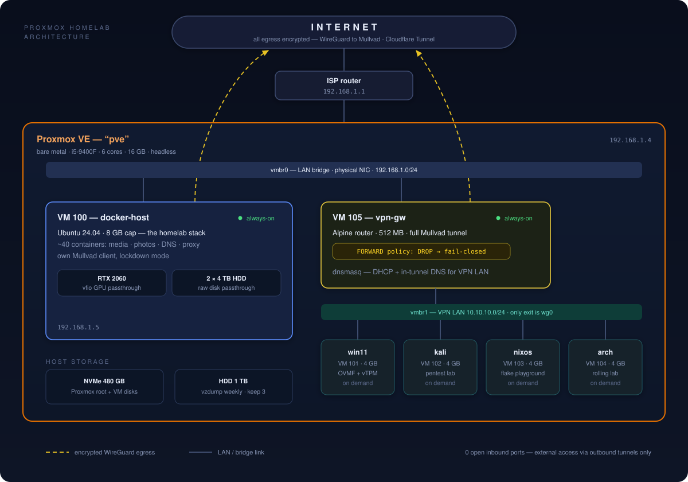
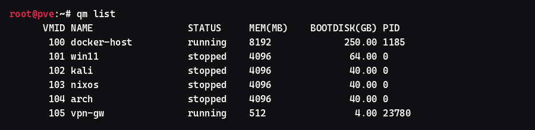
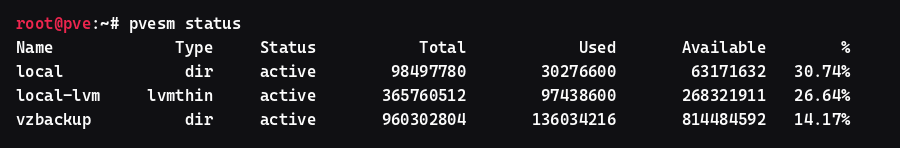

<div align="center">

# Proxmox Homelab

**The [homelab](https://github.com/MrTorriz/homelab) went virtual — same box, bare-metal Ubuntu → Proxmox VE hypervisor with six VMs, GPU + disk passthrough, and a fail-closed VPN gateway. Zero data loss.**

[](https://github.com/MrTorriz/proxmox-homelab/actions/workflows/lint.yml)
[](LICENSE)
[](https://github.com/MrTorriz/proxmox-homelab/commits/main)
[](docs/vms.md)
[](docs/architecture.md)

<br/>

[](#)
[](#)
[](#)
[](#)
[](#)
[](#)
[](#)

</div>

---

## TL;DR

- **One 16 GB desktop box, six VMs** — a hard RAM budget, not wishful overcommit ([architecture](docs/architecture.md)).
- **The old bare-metal server lives on as VM 100** — same IP, same data, restored from a ~28 GB encrypted offsite backup; the media drives — 6+ TB of data — were passed through raw and never copied ([migration](docs/migration.md)).
- **Every lab VM is born behind a VPN** — a 512 MB Alpine gateway VM tunnels an isolated bridge through Mullvad WireGuard, killswitch enforced by `FORWARD DROP`, not by a watchdog ([vpn-gateway](docs/vpn-gateway.md)).
- **Real hardware in the guest** — RTX 2060 via vfio for NVENC/ML, two 4 TB drives as whole-disk passthrough ([passthrough](docs/passthrough.md)).
- **Fourteen operational lessons** written down so they only cost once ([lessons](docs/lessons.md)).

<p align="center">
  
</p>

---

## The story

This is the virtualization layer under [MrTorriz/homelab](https://github.com/MrTorriz/homelab).
That repo documents a ~45-service Docker stack on bare-metal Ubuntu. One weekend the
machine was wiped and reborn as a Proxmox host — and the server it used to be came back
as a VM on top of itself:

1. Pack the SSD's soul (appdata, configs, secrets) into three tar archives → encrypted
   offsite storage. Audit three times for what the backup *misses* — the audits found
   real restore-breaking gaps every round.
2. Wipe. Install Proxmox VE. Move the host to a new IP, freeing the old one.
3. Rebuild the server as a cloud-init VM on the old IP. Restore. 41 containers up the
   same evening.
4. Hand the data drives and the GPU to the VM — raw passthrough, nothing copied.

Since then the host has grown a VPN gateway VM and four on-demand lab VMs. Full write-up:
[docs/migration.md](docs/migration.md).

---

## By the numbers

<table align="center">
  <tr>
    <td align="center" width="160"><h2>6</h2>VMs on one host</td>
    <td align="center" width="160"><h2>42</h2>containers in VM 100</td>
    <td align="center" width="160"><h2>8 TB</h2>passed through raw</td>
    <td align="center" width="160"><h2>0</h2>open inbound ports</td>
    <td align="center" width="160"><h2>~35 W</h2>total draw</td>
  </tr>
</table>

Sourced from [`docs/metrics.md`](docs/metrics.md) — every figure links back to the
command that produced it.

---

## The fleet

| VMID | Name | OS | RAM | Always on | Role |
|---|---|---|---|---|---|
| 100 | docker-host | Ubuntu 24.04 | 8 GB | ✅ | The workload — [homelab stack](https://github.com/MrTorriz/homelab), GPU + 2×4 TB passthrough |
| 101 | win11 | Windows 11 | 4 GB | | Desktop duties, behind the VPN |
| 102 | kali | Kali Linux | 4 GB | | Pentest lab, behind the VPN |
| 103 | nixos | NixOS | 4 GB | | Declarative playground, behind the VPN |
| 104 | arch | Arch Linux | 4 GB | | Rolling playground, behind the VPN |
| 105 | vpn-gw | Alpine | 512 MB | ✅ | Mullvad WireGuard gateway, fail-closed |

Lab VMs run one at a time — RAM is the bottleneck and the budget says so
([docs/vms.md](docs/vms.md)).

---

## Showcase

<p align="center">
  <br/>
  <sub><b>qm list</b> — the fleet: two always-on, four on demand</sub>
</p>

<p align="center">
  <br/>
  <sub><b>pvesm status</b> — boot disks on the thin pool, backups on their own spindle</sub>
</p>

---

## Design principles

1. **The host does nothing.** Virtualization and hardware health only. No Docker, no DNS,
   no apps on the hypervisor — it can reboot any time and nobody notices.
2. **No unencrypted egress.** The workload VM runs its own VPN client in lockdown mode;
   everything else sits on a bridge whose only exit is a WireGuard tunnel. Tunnel down =
   traffic dropped, not leaked.
3. **Inbound stays closed.** External access rides an outbound Cloudflare Tunnel — the
   router forwards nothing.
4. **Caps, not measurements.** Thin disks and RAM ceilings are promises the guests will
   grow into. Budget them like they're real, because they become real
   ([lesson #14](docs/lessons.md#14-ballooning-does-not-return-host-ram-on-a-running-vm)).
5. **Passthrough + protect, not pool + hope.** Single host, irreplaceable data: the
   hypervisor never touches the data drives ([docs/architecture.md](docs/architecture.md#storage-three-tiers-one-hard-line)).

---

## Repo layout

```text
.
├── docs/
│   ├── architecture.md    # Layers, bridges, storage tiers, RAM budget
│   ├── migration.md       # Bare metal → VM: backup, audits, wipe, restore
│   ├── vpn-gateway.md     # The Alpine WireGuard gateway VM, killswitch design
│   ├── passthrough.md     # GPU (vfio) + whole-disk passthrough, gotchas
│   ├── backup.md          # Two-tier strategy: encrypted offsite vs vzdump images
│   ├── vms.md             # Fleet, new-VM recipe, guest-agent tricks
│   ├── decisions.md       # Why this and not that — the alternatives were real
│   ├── runbook.md         # What to do when each layer breaks
│   ├── metrics.md         # Every README number, with its receipt
│   └── lessons.md         # 14 operational lessons, cross-referenced
├── scripts/               # sanitize-check.sh (pre-commit PII guard)
└── .github/workflows/     # CI: shellcheck · yamllint · markdownlint · gitleaks
```

---

## Documentation

- [`docs/architecture.md`](docs/architecture.md) — how one box carries all of it without the layers colliding
- [`docs/migration.md`](docs/migration.md) — the bare-metal → VM move, including the three completeness audits
- [`docs/vpn-gateway.md`](docs/vpn-gateway.md) — one Mullvad slot, unlimited VMs, fail-closed by construction
- [`docs/passthrough.md`](docs/passthrough.md) — vfio GPU + raw disks, and every gotcha they charged for
- [`docs/backup.md`](docs/backup.md) — what restores the system vs what's merely convenient
- [`docs/vms.md`](docs/vms.md) — the fleet and the recipes
- [`docs/decisions.md`](docs/decisions.md) — why these choices and not the alternatives
- [`docs/runbook.md`](docs/runbook.md) — what to do when each layer breaks
- [`docs/metrics.md`](docs/metrics.md) — every number above, with its receipt
- [`docs/lessons.md`](docs/lessons.md) — start here if you're building something similar

---

## License

MIT — fork it, copy bits, learn from it.
