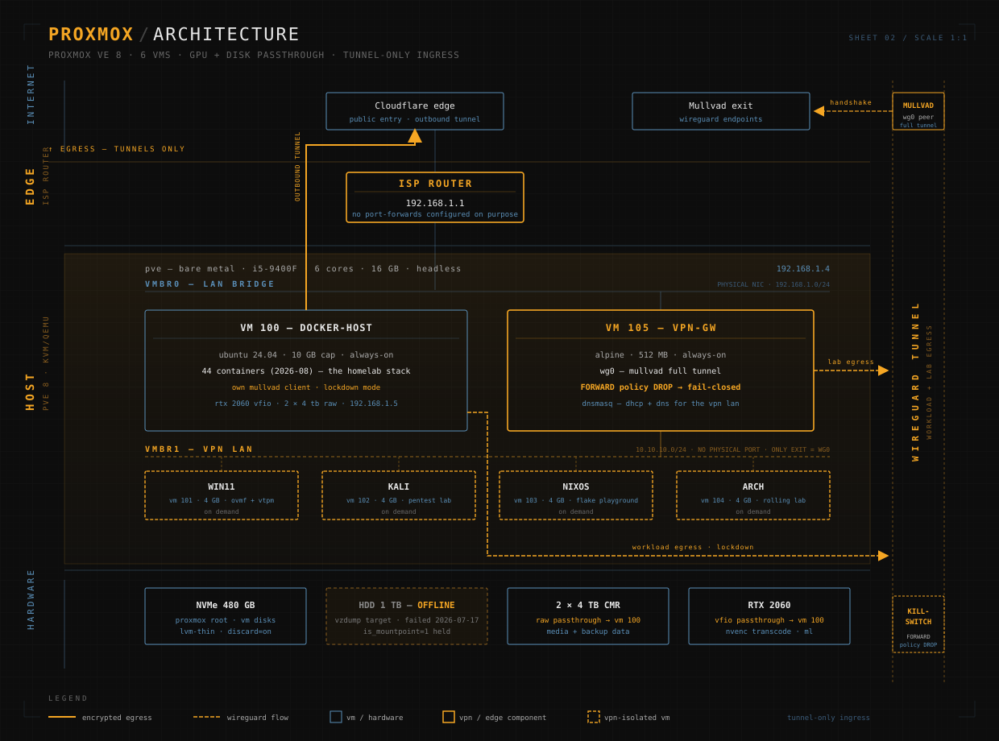
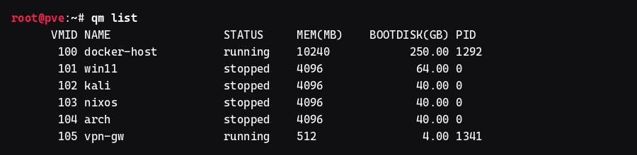
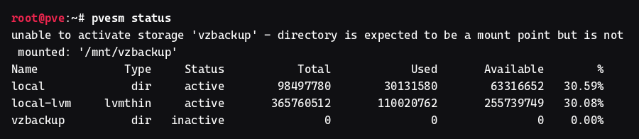

<div align="center">

# Proxmox Homelab

**The homelab, virtualized — sanitized reference of a real Proxmox VE host: six VMs, GPU + disk passthrough, fail-closed VPN gateway.**

[](https://github.com/MrTorriz/proxmox-homelab/actions/workflows/lint.yml)
[](LICENSE)
[](https://github.com/MrTorriz/proxmox-homelab/commits/main)
[](docs/vms.md)
[](docs/architecture.md)

<br/>

[](docs/vms.md)
[](docs/vpn-gateway.md)
[](https://github.com/MrTorriz/homelab)

</div>

---

> **What this is.** A sanitized public reference of a real, running Proxmox host. The live configuration is the source of truth and lives in a private repository; this repo mirrors it with hostnames, domains and identifiers replaced. It is not drop-in reproducible.

## TL;DR

- **One 16 GB desktop box, six VMs** — a hard RAM budget, not wishful overcommit ([architecture](docs/architecture.md)).
- **The old bare-metal server lives on as VM 100** — same IP, same data, restored from a ~28 GB encrypted offsite backup; the media drives — 6+ TB of data — were passed through raw and never copied ([migration](docs/migration.md)).
- **Every lab VM is born behind a VPN** — a 512 MB Alpine gateway VM tunnels an isolated bridge through Mullvad WireGuard, killswitch enforced by `FORWARD DROP`, not by a watchdog ([vpn-gateway](docs/vpn-gateway.md)).
- **Real hardware in the guest** — RTX 2060 via vfio for NVENC/ML, two 4 TB drives as whole-disk passthrough ([passthrough](docs/passthrough.md)).
- **Fifteen operational lessons** written down so they only cost once ([lessons](docs/lessons.md)).

<p align="center">
  
</p>

---

## The story

This is the virtualization layer under [MrTorriz/homelab](https://github.com/MrTorriz/homelab).
That repo documents the Docker stack (44 containers as of 2026-08-28) that used to run on
bare-metal Ubuntu. One weekend the machine was wiped and reborn as a Proxmox host — and
the server it used to be came back as a VM on top of itself:

1. Pack what the SSD held that mattered (appdata, configs, secrets) into three tar
   archives → encrypted offsite storage. Audit three times for what the backup *misses* —
   the audits found real restore-breaking gaps every round.
2. Wipe. Install Proxmox VE. Move the host to a new IP, freeing the old one.
3. Rebuild the server as a cloud-init VM on the old IP. Restore. 41 containers up the
   same evening.
4. Hand the data drives and the GPU to the VM — raw passthrough, nothing copied.

Since then the host has grown a VPN gateway VM and four on-demand lab VMs. Full write-up:
[docs/migration.md](docs/migration.md).

---

## Verified snapshot — 2026-08-28

| | | Source |
|---|---|---|
| Proxmox VE | 8.4.21 · kernel 6.8.12-42-pve | `pveversion` |
| VMs | 6 (2 always-on) | `qm list` |
| VM 100 | 10 GB cap · 250 GB thin disk · 44 containers | `qm config 100` · `docker ps` |
| Passthrough | RTX 2060 + 2 × 4 TB raw | `qm config 100` |
| Storage | local 30.6 % · local-lvm 30.1 % · vzbackup inactive since 2026-07-17 | `pvesm status` |
| Power | not re-measured since 2026-07-03 (Scaphandre removed 2026-07-04) | — |

<sub>Read from the live host on the date above; nothing here updates automatically. What was and was not re-measured: <a href="docs/metrics.md">docs/metrics.md</a>.</sub>

---

## The fleet

| VMID | Name | OS | RAM | Always on | Role |
|---|---|---|---|---|---|
| 100 | docker-host | Ubuntu 24.04 | 10 GB | ✅ | The workload — [homelab stack](https://github.com/MrTorriz/homelab), GPU + 2×4 TB passthrough |
| 101 | win11 | Windows 11 | 4 GB | | Desktop duties, behind the VPN |
| 102 | kali | Kali Linux | 4 GB | | Pentest lab, behind the VPN |
| 103 | nixos | NixOS | 4 GB | | Declarative playground, behind the VPN |
| 104 | arch | Arch Linux | 4 GB | | Rolling playground, behind the VPN |
| 105 | vpn-gw | Alpine | 512 MB | ✅ | Mullvad WireGuard gateway, fail-closed |

Lab VMs run one at a time — RAM is the bottleneck and the budget says so
([docs/vms.md](docs/vms.md)). What runs inside VM 100:
[MrTorriz/homelab](https://github.com/MrTorriz/homelab).

---

## Showcase

<p align="center">
  <br/>
  <sub><b>qm list</b> — sanitized recreation from live-verified output (2026-08-28); VM 100 renamed docker-host</sub>
</p>

<p align="center">
  <br/>
  <sub><b>pvesm status</b> — sanitized recreation from live-verified output (2026-08-28): local and local-lvm active, vzbackup inactive since the backup disk failed 2026-07-17</sub>
</p>

---

## Design principles

1. **The host does nothing.** Virtualization and hardware health only. No Docker, no DNS,
   no apps on the hypervisor — it can reboot any time and nobody notices. The short list
   of exceptions is in [architecture](docs/architecture.md#what-the-host-does-run).
2. **No unencrypted egress.** The workload VM runs its own VPN client in lockdown mode;
   everything else sits on a bridge whose only exit is a WireGuard tunnel. Tunnel down =
   traffic dropped, not leaked.
3. **Inbound stays closed.** No inbound WAN ports are configured on purpose — external
   access rides an outbound Cloudflare Tunnel from the workload VM. The router's
   port-forward table was not re-verified during the 2026-08-28 audit.
4. **Caps, not measurements.** Thin disks and RAM ceilings are promises the guests will
   grow into. Budget them like they're real, because they become real
   ([lesson #14](docs/lessons.md#14-ballooning-does-not-return-host-ram-on-a-running-vm)).
5. **Passthrough + protect, not pool + hope.** Single host, irreplaceable data: the
   hypervisor never touches the data drives ([docs/architecture.md](docs/architecture.md#storage-three-tiers-one-hard-line)).

---

## Repo layout

```text
.
├── docs/
│   ├── architecture.md    # Layers, bridges, storage tiers, RAM budget
│   ├── migration.md       # Bare metal → VM: backup, audits, wipe, restore
│   ├── vpn-gateway.md     # The Alpine WireGuard gateway VM, killswitch design
│   ├── passthrough.md     # GPU (vfio) + whole-disk passthrough, gotchas
│   ├── backup.md          # Two-tier strategy (tier 2 offline since 2026-07)
│   ├── vms.md             # Fleet, new-VM recipe, guest-agent tricks
│   ├── decisions.md       # Why this and not that — the alternatives were real
│   ├── runbook.md         # What to do when each layer breaks
│   ├── metrics.md         # Every README number, with its receipt
│   └── lessons.md         # 15 operational lessons, cross-referenced
├── scripts/               # sanitize-check.sh (pre-commit PII guard) · check-links.sh (CI)
├── SECURITY.md            # How to report a sanitization miss
└── .github/workflows/     # CI: shellcheck · yamllint · markdownlint · links · gitleaks
```

---

## Documentation

- [`docs/architecture.md`](docs/architecture.md) — how one box carries all of it without the layers colliding
- [`docs/migration.md`](docs/migration.md) — the bare-metal → VM move, including the three completeness audits
- [`docs/vpn-gateway.md`](docs/vpn-gateway.md) — one Mullvad slot, unlimited VMs, fail-closed by construction
- [`docs/passthrough.md`](docs/passthrough.md) — vfio GPU + raw disks, and every gotcha they charged for
- [`docs/backup.md`](docs/backup.md) — what restores the system vs what's merely convenient (and what happened when the convenient tier died)
- [`docs/vms.md`](docs/vms.md) — the fleet and the recipes
- [`docs/decisions.md`](docs/decisions.md) — why these choices and not the alternatives
- [`docs/runbook.md`](docs/runbook.md) — what to do when each layer breaks
- [`docs/metrics.md`](docs/metrics.md) — every number above, with its receipt
- [`docs/lessons.md`](docs/lessons.md) — start here if you're building something similar

---

## License

MIT — fork it, copy bits, learn from it.
